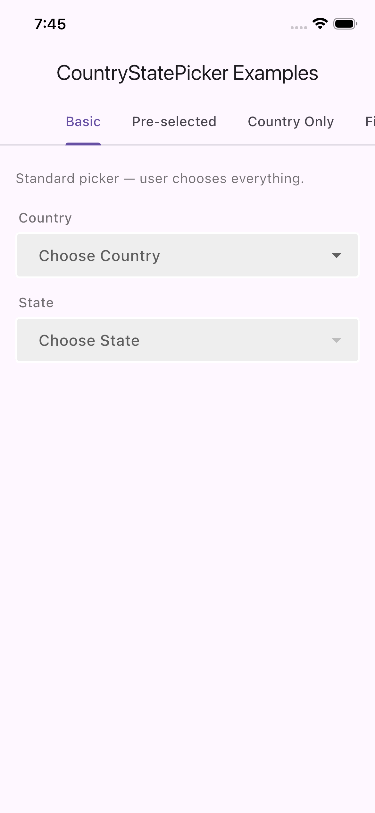
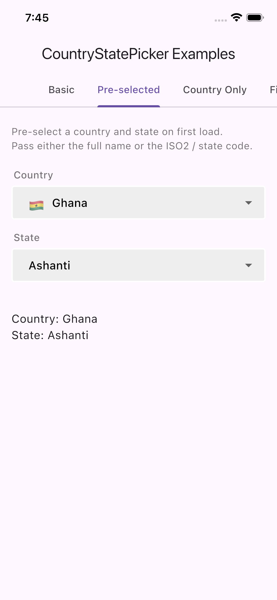
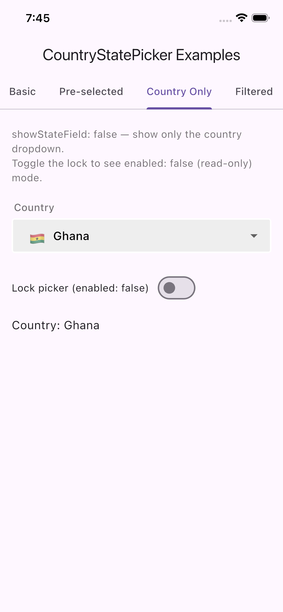
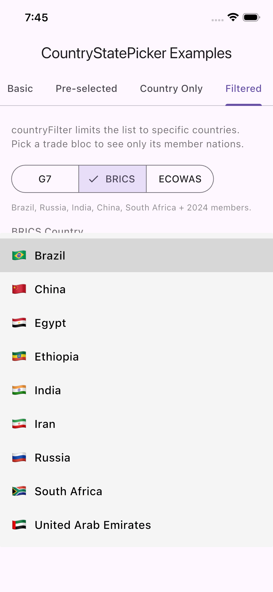

### Description

A Flutter package for selecting countries and their states/regions from searchable dropdown fields. Compatible with iOS, Android, and Web.

---

### Screenshots

|              Basic              |                 Pre-selected                  |                 Country Only                  |               Filtered                |
| :-----------------------------: | :-------------------------------------------: | :-------------------------------------------: | :-----------------------------------: |
|  |  |  |  |

> Take screenshots of each example tab and save them to a `screenshots/` folder at the project root.

---

### Features

- Select Country with emoji flag
- Select State / Region for the chosen country
- Pre-select initial country and state on first load
- Hide the state dropdown (country-only mode)
- Disable / read-only mode
- Filter the country list to a custom subset
- Validate country and state on form submission
- Fast — country data is cached after the first load

### Parameters

| Param              | Required |       Default        |         Type         | Description                                                         |
| ------------------ | :------: | :------------------: | :------------------: | ------------------------------------------------------------------- |
| `onCountryChanged` |    ✅    |          —           |  `Function(String)`  | Called when the user selects a country                              |
| `onStateChanged`   |    ✅    |          —           |  `Function(String)`  | Called when the user selects a state                                |
| `initialCountry`   |    ❌    |          —           |      `String?`       | Pre-select a country by name ("Ghana") or ISO2 code ("GH")          |
| `initialState`     |    ❌    |          —           |      `String?`       | Pre-select a state by name or state code. Requires `initialCountry` |
| `showStateField`   |    ❌    |        `true`        |        `bool`        | Set to `false` to hide the state dropdown (country-only mode)       |
| `enabled`          |    ❌    |        `true`        |        `bool`        | Set to `false` to make both dropdowns read-only                     |
| `countryFilter`    |    ❌    |          —           |   `List<String>?`    | Limit the country list to specific countries by name or ISO2 code   |
| `countryLabel`     |    ❌    |   Label("Country")   |      `Widget?`       | Widget rendered above the country dropdown                          |
| `stateLabel`       |    ❌    |    Label("State")    |      `Widget?`       | Widget rendered above the state dropdown                            |
| `countryHintText`  |    ❌    |   "Choose Country"   |      `String?`       | Hint text for the country dropdown                                  |
| `stateHintText`    |    ❌    |    "Choose State"    |      `String?`       | Hint text for the state dropdown                                    |
| `noStateFoundText` |    ❌    |  "No States Found"   |      `String?`       | Shown when the selected country has no states                       |
| `countryValidator` |    ❌    |          —           | `ValidatorFunction?` | Validate country selection on form submit                           |
| `stateValidator`   |    ❌    |          —           | `ValidatorFunction?` | Validate state selection on form submit                             |
| `onCountryTap`     |    ❌    |          —           |   `VoidCallback?`    | Called when the country dropdown is tapped                          |
| `onStateTap`       |    ❌    |          —           |   `VoidCallback?`    | Called when the state dropdown is tapped                            |
| `inputDecoration`  |    ❌    |    built-in style    |  `InputDecoration?`  | Custom decoration applied to both dropdowns                         |
| `flagSize`         |    ❌    |         22.0         |      `double?`       | Size of the flag emoji on the selected-value label                  |
| `listFlagSize`     |    ❌    |         22.0         |      `double?`       | Size of the flag emoji in the dropdown list                         |
| `hintTextStyle`    |    ❌    |          —           |     `TextStyle?`     | Text style for hint / selected-value text                           |
| `itemTextStyle`    |    ❌    |          —           |     `TextStyle?`     | Text style for dropdown list items                                  |
| `dropdownColor`    |    ❌    |   Colors.grey[100]   |       `Color?`       | Background color of the dropdown list                               |
| `elevation`        |    ❌    |          0           |        `int?`        | Elevation of the dropdown list                                      |
| `isExpanded`       |    ❌    |        `true`        |       `bool?`        | Whether the dropdown fills its parent width                         |
| `divider`          |    ❌    | SizedBox(height: 10) |      `Widget?`       | Widget between the country and state fields                         |

### How To Use

1. Import the package

   ```dart
   import 'package:country_state_picker/country_state_picker.dart';
   ```

2. Basic usage

   ```dart
   CountryStatePicker(
     onCountryChanged: (country) => setState(() => _country = country),
     onStateChanged:  (state)   => setState(() => _state   = state),
   )
   ```

3. Pre-select Ghana / Ashanti on load

   ```dart
   CountryStatePicker(
     initialCountry: 'GH',      // or "Ghana"
     initialState:  'Ashanti',  // or state code
     onCountryChanged: (ct) => setState(() => _country = ct),
     onStateChanged:  (st) => setState(() => _state   = st),
   )
   ```

4. Country-only picker (no state dropdown)

   ```dart
   CountryStatePicker(
     showStateField: false,
     onCountryChanged: (ct) => setState(() => _country = ct),
     onStateChanged:  (_)  {},
   )
   ```

5. Restrict to specific countries

   ```dart
   CountryStatePicker(
     countryFilter: const ['GH', 'NG', 'KE', 'ZA'],
     onCountryChanged: (ct) => setState(() => _country = ct),
     onStateChanged:  (st) => setState(() => _state   = st),
   )
   ```

---

### Todo

- [x] Select Country
- [x] Select State
- [x] Validate Country and State
- [x] Pre-select initial values
- [x] Country-only mode
- [x] Read-only / disabled mode
- [x] Country filter
- [ ] Select City
